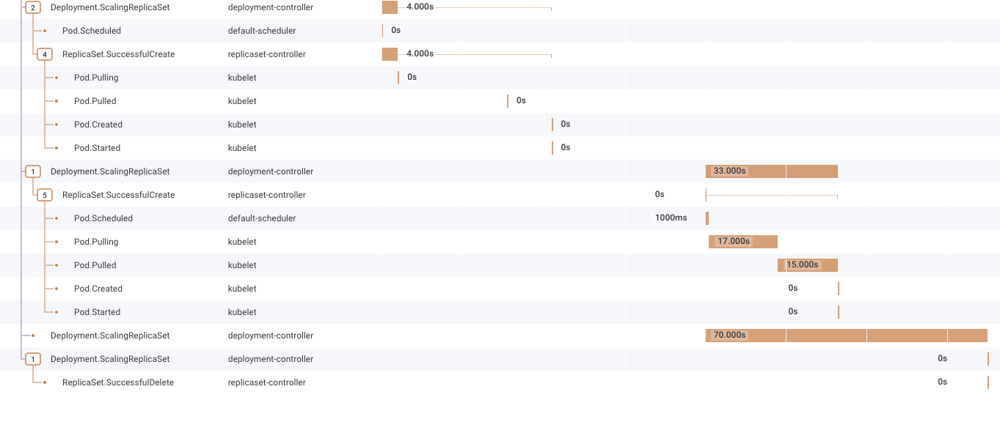

# kspan - Turning Kubernetes Events into spans

This kspan repo was originally forked from https://github.com/weaveworks-experiments/kspan and has gone through several iterations by Honeycomb before landing here.

## This project is a Work In Progress, under active evolution.

Most Kubernetes components produce Events when something interesting happens.
This program turns those Events into OpenTelemetry Spans, joining them up by causality and grouping them together into Traces.

Example: Scaling up a replicaset, which eventually leads to an error that can be used as a trigger.

The picture was generated by `kspan` and Honeycomb; it is a visualisation of the events generated from scaling up a deployment.
`kspan` will identify the lifecycle of the Deployment, and the lifecycle of the ReplicaSet used to control the Pods.

We start with this concrete information:
 - Each Event has an Involved Object. For example, when Kubelet sends a "Started" event, the Involved Object is a Pod.
 - Every Kubernetes object can have one or more Owner References, so we can walk from the Pod up to a Deployment that caused it to be created.

Complications:
 - We cannot expect events to arrive in the ideal order; we need to delay handling some until their "parent" arrives to make sense.

Heuristics:
 - If we recently saw an event from an owner, that probably caused this event in the owned object. We set the child-of relationship on the new span.
 - A couple of specific events from ReplicationSet and StatefulSet are reported on the owner, but make more sense as events on the sub-object they mention.
 - An event can be marked in its annotations as the start of a trace.
 - If we have walked the owner chain up to an object with no owner, no recent event, then start a new trace.
   - Trace ID is hashed from UID of this object and its generation.

For future consideration:
 - We can match up `resourceVersion` between event and object.
   - Do we need to?

## Testing

kspan is verified at two levels.

**Unit + Tier-1 e2e (deterministic, no cluster).**
`make test` runs the unit tests: a fake controller-runtime client plus a captured-span exporter, driven by a YAML "playback" harness that replays recorded Event sequences with the clock controlled via `pkg/mtime`.
`make test-e2e` runs the Tier-1 e2e test, which points kspan's real OTLP/gRPC exporter at an in-process OTLP receiver and asserts on the spans it receives over the wire (span count, single trace root, full parent/child connectivity, and the `service.name = "kspan"` resource rewrite).
This exercises the real export path deterministically and is the CI gate.

A real-cluster smoke test (kind + Jaeger, generating live Kubernetes Events and viewing the traces in the Jaeger UI) is a possible future addition for human visual confirmation, but is not currently part of the repo.
